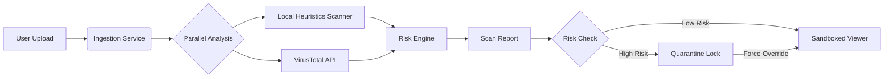

# System Architecture

## High-Level Design

Sentinel PDF follows a **Pipeline Architecture** consisting of three distinct phases: **Ingestion**, **Analysis**, and **Presentation**.

## Core Modules

### 1. Scanner Service (`services/scanner.ts`)
This module handles the "Pre-Execution" phase. It operates on the raw `File` object before the PDF parser is even initialized.

*   **Hashing**: Uses the Web Crypto API to generate SHA-256 hashes.
*   **Binary Regex**: Converts the `ArrayBuffer` to text to scan for PDF-specific threat signatures.
    *   *Why?* Malformed PDFs can crash parsers. Scanning the raw bytes is safer than parsing the tree structure for initial detection.

### 2. AI Intelligence Service (`services/geminiService.ts`)
Connects to Google's Gemini API to provide context.

*   **Input**: JSON representation of the Scan Report (Heuristics + VT stats).
*   **Prompt Engineering**: Instructs the model to act as a cybersecurity expert and output a non-technical summary.
*   **Model**: Uses `gemini-2.5-flash` for low latency.

### 3. Secure Renderer (`components/SecurePDFViewer.tsx`)
This is the isolation layer.

*   **Library**: `pdfjs-dist`
*   **Isolation Strategy**:
    1.  **Worker Isolation**: Parsing happens in a web worker (managed by pdf.js).
    2.  **Presentation Isolation**: We use `canvas` context rendering (`page.render({ canvasContext })`).
    *   *Contrast*: Standard viewers often use SVG or HTML layers for text selection. We deliberately disable this to prevent malicious font crafting or hidden transparent overlays.

## Data Flow & State Management

*   **State**: Local React state manages the `ScanReport` and `Config`.
*   **Persistence**: Currently ephemeral (per session).
*   **Types**: All data interfaces are strictly typed in `types.ts` to ensure consistency between the Scanner and the View layer.

## Future Extensibility

The modular design allows for swapping components:
*   **Scanner**: Can be extended to support ClamAV or other local engines via WebAssembly.
*   **Storage**: Can easily add LocalStorage or a backend DB to persist scan history.
